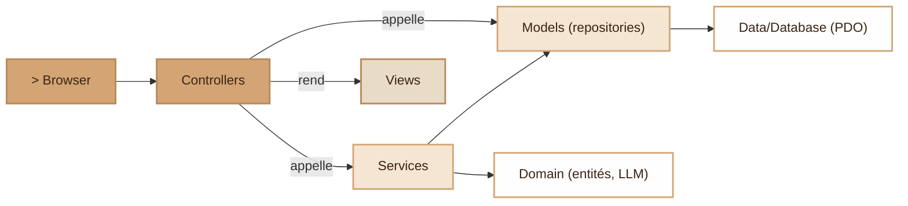
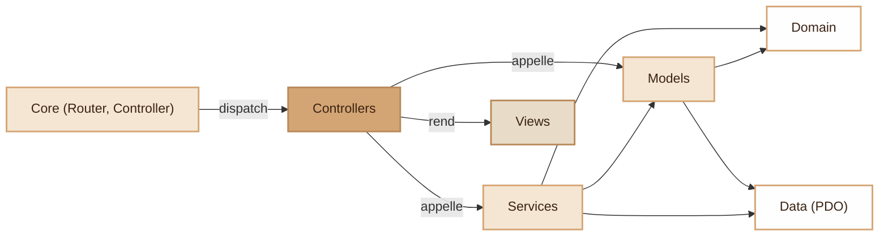
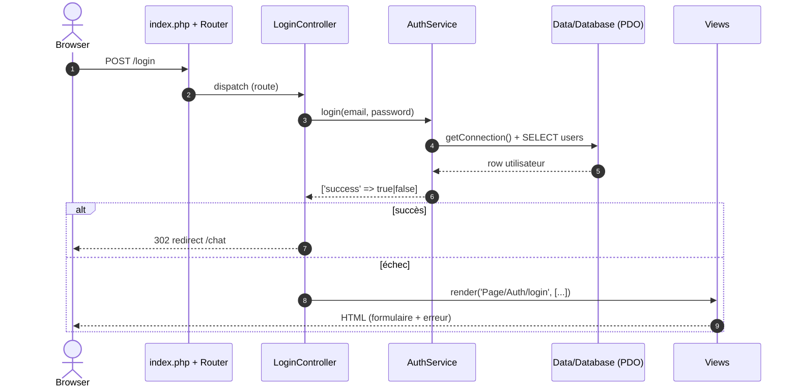

# Architecture applicative I-AMU

> **But du document** — définir l'architecture cible de l'application :
> un **MVC classique enrichi d'une couche Domain** (Model / View / Controller
> + Domain). On revient volontairement à ce modèle après une tentative
> d'architecture hexagonale (Domain / Application / Infrastructure / Ports)
> jugée trop lourde pour la taille de l'équipe et le rythme du projet.

---

## 1. Objectifs et contraintes

### Pourquoi MVC + Domain (et pas l'hexagonal)

- **Simplicité avant tout** — peu de couches, peu de fichiers, peu de
  cérémonie. Un nouveau contributeur lit un MVC classique immédiatement.
- **Pas de câblage manuel verbeux** — on instancie directement (`new`)
  ce dont on a besoin, plutôt que d'assembler un `bootstrap.php` géant.
- **Accès base simple** — une connexion PDO unique exposée par un
  singleton `Data\Database`, accessible depuis les Models et les Services.
- **On garde un Domain** — pour isoler les concepts métier *riches*
  (l'IA et ses adaptateurs LLM), là où une simple fonction ne suffit pas.

### Objectifs

- **Controller petit** : il lit ses entrées HTTP, appelle un Service ou un
  Model, puis rend une Vue. Pas de SQL, pas de calcul métier lourd.
- **Métier regroupé** dans `Services/` (logique applicative) et `Domain/`
  (concepts métier et comportements).
- **PHP 8.1+ natif** : routeur maison (`Core/Router`), contrôleur de base
  maison (`Core/Controller`), autoloader Composer (PSR-4).

### Non-objectifs (anti-périmètre)

- ❌ Pas d'architecture hexagonale complète, pas de couche `Application/`
  ni `Infrastructure/`, pas de dossier `Ports/`.
- ❌ Pas de conteneur d'injection ni de câblage manuel exhaustif :
  l'instanciation directe (`new AuthService()`) est **assumée**.
- ❌ Pas d'ORM (Doctrine, Eloquent) — PDO direct dans les Models.
- ❌ Pas de DTO ni de ViewModel systématiques — les vues reçoivent des
  tableaux simples ou des entités du Domain.
- ❌ Pas d'interface pour chaque classe — **une seule** est conservée,
  l'adaptateur LLM (`LlmAdaptaterInterface`), parce qu'on veut pouvoir
  remplacer Ollama par un autre fournisseur.

---

## 2. Vue d'ensemble



Le **Controller** est le chef d'orchestre d'une requête : il délègue le
métier aux **Services**, l'accès aux données aux **Models**, et termine en
rendant une **View**. Le **Domain** porte les concepts métier riches.
La **Data** est la seule porte vers PostgreSQL.

**Règle simple** — un Controller ne fait jamais de SQL lui-même ; un Model
ne sait rien du HTTP ; une View ne contient pas de logique métier.

---

## 3. Couches et responsabilités

### 3.1 `Core/` — micro-framework

Le « moteur » HTTP minimal. **Aucune logique métier.**

| Classe                  | Rôle                                                          |
|-------------------------|--------------------------------------------------------------|
| `Router`                | Table de routes (`add()`) → résolution (`compare()`).        |
| `Controller` (abstrait) | Base de tous les contrôleurs : `render()`, `redirect()`, `input()`, helpers de session/flash. |

```php
namespace Core;

abstract class Controller
{
    protected function render(string $view, array $data = [], string $layout = 'main'): void { /* ... */ }
    protected function redirect(string $url): never { /* ... */ }
    protected function input(string $key, mixed $default = null): mixed { /* ... */ }
}
```

> Ce que **ne fait pas** `Core/` : pas de SQL, pas d'appel Ollama. Si on
> remplaçait toute la couche métier, `Core/` resterait intact.

### 3.2 `Controllers/` — le « C » de MVC

Point d'entrée HTTP. Chaque contrôleur **étend `Core\Controller`**, lit ses
entrées, appelle un Service ou un Model, puis rend une vue. Il instancie
directement ses dépendances.

```php
namespace Controllers;

use Core\Controller;
use Services\AuthService;

class LoginController extends Controller
{
    private AuthService $authService;

    public function __construct()
    {
        $this->authService = new AuthService();      // instanciation directe assumée
    }

    public function login(): void
    {
        $email    = trim($this->input('email', ''));
        $password = $this->input('password', '');

        $result = $this->authService->login($email, $password);

        if (!$result['success']) {
            $this->render('Page/Auth/login', ['error' => $result['error'], 'email' => $email], 'auth');
            return;
        }
        $this->redirect('/chat');
    }
}
```

### 3.3 `Services/` — logique applicative

Un Service porte un **cas d'usage** ou un domaine fonctionnel (ex.
`AuthService` : inscription, connexion, déconnexion). Il orchestre les
Models et le Domain, et peut récupérer la connexion via le singleton.

```php
namespace Services;

use Data\Database;
use PDO;

class AuthService
{
    private PDO $pdo;

    public function __construct()
    {
        $this->pdo = Database::getConnection();       // singleton autorisé
    }

    /** @return array{success: bool, error?: string} */
    public function login(string $email, string $password): array { /* ... */ }
}
```

> Un Service peut soit parler à PDO directement (cas simple), soit déléguer
> à un Model/repository quand la requête est réutilisée ailleurs.

### 3.4 `Models/` — repositories (le « M » de MVC)

Les Models encapsulent l'**accès aux données**. Convention : un
`*Repository` par table/agrégat. Ils reçoivent une connexion `PDO` au
constructeur, exécutent des requêtes préparées et renvoient des lignes
(tableaux associatifs) ou des entités du Domain.

```php
namespace Models;

use PDO;

class AiRepository
{
    public function __construct(private PDO $pdo) {}

    public function getModelByName(string $name): ?array
    {
        $stmt = $this->pdo->prepare('SELECT * FROM models WHERE name = :name');
        $stmt->execute(['name' => $name]);
        return $stmt->fetch() ?: null;
    }
}
```

> Pas d'ActiveRecord : une entité ne sait pas s'enregistrer elle-même
> (`$ai->save()`). C'est le repository qui lit et écrit.

### 3.5 `Domain/` — concepts métier riches

Le cœur métier *comportemental*. On y trouve les entités qui ont une vraie
logique, et **l'unique abstraction conservée** : l'adaptateur LLM.

| Fichier                    | Rôle                                                        |
|----------------------------|-------------------------------------------------------------|
| `Ai.php`, `Conversation.php` | Entités métier (données + comportements, ex. `Ai::ask()`). |
| `LlmAdaptaterInterface.php` | **Contrat** d'un fournisseur LLM (`generate()`).            |
| `OllamaAdaptater.php`      | Implémentation Ollama du contrat (vit ici, à côté de l'interface). |
| `TestException.php`        | Exceptions métier.                                          |

```php
namespace Domain;

interface LlmAdaptaterInterface
{
    /** Formate la requête vers l'API cible, l'exécute, renvoie une chaîne standard. */
    public function generate(string $message, array $context): string;
}

class Ai
{
    public function __construct(/* ... */ private LlmAdaptaterInterface $adaptater) {}

    public function ask(string $message, array $context): string
    {
        return $this->adaptater->generate($message, $context);   // délègue au fournisseur
    }
}
```

> Pourquoi garder **cette** interface ? Parce qu'on veut pouvoir brancher
> Ollama aujourd'hui, OpenAI demain, sans toucher à `Ai`. C'est le seul
> endroit où la substitution a une valeur réelle ; ailleurs, on reste
> concret pour rester simple.

### 3.6 `Data/` — connexion à la base

Une seule classe : `Database`, un **singleton** qui expose la connexion PDO
partagée. C'est le seul point du code autorisé à instancier PDO.

```php
namespace Data;

use PDO;

class Database
{
    private static ?PDO $instance = null;

    public static function getConnection(): PDO
    {
        if (self::$instance === null) {
            $config = require __DIR__ . '/../Config/config.php';
            self::$instance = new PDO(/* dsn, user, password, options */);
        }
        return self::$instance;
    }
}
```

> Choix assumé : le singleton centralise la connexion et évite de la
> propager partout. Le compromis (couplage à un état global, tests plus
> rigides) est accepté au nom de la simplicité — voir
> [`acces-base-de-donnees.md`](../acces-base-de-donnees.md).

### 3.7 `Views/` — le « V » de MVC

Templates PHP purs. Organisation :

- `Views/Layout/` — gabarits englobants (`main.php`, `auth.php`, `chat.php`).
- `Views/Page/` — pages, éventuellement en sous-dossiers (`Page/Auth/login.php`).

Une vue reçoit des variables simples via `render()` et affiche. **Pas
d'appel à la base, pas de logique métier** dans une vue.

### 3.8 `Config/` et `Helpers/`

- `Config/config.php` — configuration (base, Ollama, mail…), retournée
  comme tableau.
- `Helpers/` — fonctions utilitaires sans état (ex. `icon()`), utilisées
  surtout dans les vues.

---

## 4. Règles de dépendance

Une flèche `A --> B` se lit « A dépend de / appelle B ». Tout coule de
gauche (HTTP) vers la droite (la donnée) ; rien ne remonte.



Ce qui se lit directement sur le graphe :

- **`Domain` et `Data` n'ont aucune flèche sortante** — ce sont les points
  d'arrivée. Le Domain ne dépend de rien (hormis PHP natif et ses propres
  interfaces) ; `Data` est la seule porte vers PostgreSQL.
- **`Data` n'est atteint que par `Models` et `Services`** — un Controller
  passe toujours par eux pour la donnée, jamais par `Data` en direct (pas
  de flèche `Controllers --> Data`).
- **Aucun cycle** — la flèche va toujours du HTTP vers la donnée, jamais
  l'inverse.

---

## 5. Structure de dossiers cible

```
.
├── autoload.php                 ← autoload PSR-4
├── composer.json / composer.lock
├── Dockerfile
├── phpcs.xml                    ← règles PHP_CodeSniffer
├── phpstan.neon / phpstan-baseline.neon
├── phpunit.xml.dist
├── public/
│   ├── assets/                  ← css, img, favicon
│   └── index.php                ← front controller (routes + dispatch)
├── src/
│   ├── bootstrap.php            ← autoload vendor + chargement .env
│   ├── Config/
│   │   └── config.php
│   ├── Controllers/             ← le « C » : endpoints HTTP
│   │   ├── AccueilController.php
│   │   ├── LoginController.php
│   │   ├── LLMController.php
│   │   └── dbController.php
│   ├── Core/                    ← micro-framework (Router, Controller)
│   ├── Data/
│   │   └── Database.php         ← singleton de connexion PDO
│   ├── Domain/                  ← entités + adaptateurs LLM + exceptions
│   │   ├── Ai.php
│   │   ├── Conversation.php
│   │   ├── LlmAdaptaterInterface.php
│   │   ├── OllamaAdaptater.php
│   │   └── TestException.php
│   ├── Helpers/
│   ├── Models/                  ← le « M » : repositories (accès données)
│   │   ├── AiRepository.php
│   │   ├── ConversationRepository.php
│   │   ├── InteractionRepository.php
│   │   └── UserRepository.php
│   ├── Services/                ← logique applicative (AuthService, …)
│   └── Views/                   ← le « V » : Layout/ + Page/
└── tests/
    ├── Integration/
    └── Unit/
```

> **Normalisation à prévoir** lors du réagencement du code : aligner
> quelques noms hérités sur les conventions §6 — `dbController.php` →
> `DbController.php`, et le format `Conversation.repository.php` →
> `ConversationRepository.php`.

---

## 6. Conventions

### Namespaces et fichiers

- Le namespace **est le nom du dossier**, sans préfixe `App\` :
  - `Core\Router`, `Core\Controller`
  - `Controllers\LoginController`
  - `Services\AuthService`
  - `Models\AiRepository`
  - `Domain\Ai`, `Domain\LlmAdaptaterInterface`
  - `Data\Database`
- **PascalCase** pour les classes et les dossiers de classes.
- Un fichier = une classe, même nom.

### Suffixes recommandés

| Suffixe        | Couche       | Sens                                        |
|----------------|--------------|---------------------------------------------|
| `*Controller`  | Controllers  | Endpoint HTTP                               |
| `*Repository`  | Models       | Accès aux données d'une table/agrégat       |
| `*Service`     | Services     | Logique applicative / cas d'usage           |
| `*Interface`   | Domain       | Contrat (ex. `LlmAdaptaterInterface`)       |
| `*Adaptater`   | Domain       | Implémentation d'un contrat LLM             |
| `*Exception`   | Domain       | Erreur métier                               |

### Méthodes et visibilité

- Toujours typer arguments et retours (PHP 8.1+).
- `private` / `protected` selon l'usage ; pas de préfixe `_`.
- Requêtes **toujours préparées** (`prepare` + `execute`), jamais de SQL
  concaténé avec des entrées utilisateur.

---

## 7. Patterns clés

### 7.1 Connexion via le singleton

Une connexion unique, créée à la première demande, réutilisée ensuite.

```php
$pdo = Database::getConnection();   // dans un Service ou en câblant un Model
```

### 7.2 Repository (Model)

Un `*Repository` reçoit le PDO et expose des requêtes nommées par
intention (`getModelByName`, `findActiveForUser`), pas du CRUD anonyme.

```php
$aiRepo = new AiRepository(Database::getConnection());
$model  = $aiRepo->getModelByName('mistral');
```

### 7.3 Service

Un Service regroupe la logique d'un domaine fonctionnel et renvoie un
résultat exploitable par le Controller (souvent un tableau de statut).

```php
$result = (new AuthService())->login($email, $password);
// ['success' => true] | ['success' => false, 'error' => '...']
```

### 7.4 Adaptateur LLM (la seule interface)

Le Domain dépend de `LlmAdaptaterInterface`, jamais de `OllamaAdaptater`
en dur. Changer de fournisseur = écrire un nouvel adaptateur implémentant
l'interface.

```php
$ai = new Ai(/* ... */, new OllamaAdaptater($url));
$reponse = $ai->ask($message, $context);   // délègue à l'adaptateur
```

### 7.5 Controller → View

Le Controller prépare des données simples et délègue l'affichage.

```php
$this->render('Page/Auth/login', ['titrePage' => 'Connexion'], 'auth');
```

---

## 8. Workflow d'une requête HTTP

Exemple : un utilisateur soumet le formulaire de connexion.



Lecture rapide :
- **1-2** : routage HTTP (`Core/Router`).
- **3** : le Controller délègue au Service.
- **4-6** : le Service parle à la base via le singleton et renvoie un statut.
- **7-9** : le Controller redirige (succès) ou re-rend la vue (échec).

---

## 9. Bootstrap et routing

Pas de conteneur d'injection. Le démarrage reste léger :

- `src/bootstrap.php` — charge l'autoload Composer et le `.env`.
- `public/index.php` — front controller : démarre la session, déclare les
  routes (`Router::add`), puis dispatche (`Router::compare`). Les
  contrôleurs sont instanciés au moment du dispatch.

```php
// public/index.php (extrait)
$router = new Core\Router();
$router->add('GET',  '/login', fn() => (new Controllers\LoginController())->showLogin());
$router->add('POST', '/login', fn() => (new Controllers\LoginController())->login());
$router->compare($_SERVER['REQUEST_URI'], $_SERVER['REQUEST_METHOD']);
```

> Le câblage est local et explicite : on lit une route, on voit le
> contrôleur et la méthode appelés. Si le fichier de routes devient trop
> gros, on le découpera par domaine, sans introduire de magie.

---

## 10. Tests

| Type            | Cible                                   | Notes                                   |
|-----------------|-----------------------------------------|-----------------------------------------|
| **Unit**        | Domain (entités, adaptateurs)           | PHPUnit. Un fake adaptateur LLM suffit. |
| **Integration** | `*Repository` contre une DB de test     | PHPUnit + PostgreSQL temporaire.        |

> Limite connue du singleton : un test qui touche `Database::getConnection()`
> dépend d'une vraie connexion. Pour le métier pur (Domain), on injecte un
> faux adaptateur et on teste sans base. **Règle : un bug = un test.**

---

## 11. Ce qui change par rapport à la tentative hexagonale

| Aspect              | Hexagonal (abandonné)                          | MVC + Domain (cible)                          |
|---------------------|------------------------------------------------|-----------------------------------------------|
| Couches             | Core / Domain / Application / Infrastructure / Http | Core / Controllers / Services / Models / Domain / Data / Views |
| Connexion DB        | `PdoConnection` injecté                         | `Data\Database::getConnection()` (singleton)  |
| Use-cases           | `Application/Services` + DTOs + Ports           | `Services/` simples, sans DTO ni Port         |
| Repositories        | `Infrastructure/Persistence/Pdo*Repository`     | `Models/*Repository`                          |
| Interfaces          | Une par dépendance externe (Ports)              | Une seule (`LlmAdaptaterInterface`)           |
| Injection           | Constructeur + `bootstrap.php` exhaustif        | Instanciation directe (`new`)                 |
| Vues                | ViewModels typés                                | Tableaux simples / entités                    |

Le gain visé : **moins de fichiers, moins de câblage, lecture immédiate**.
Le coût accepté : moins de découplage et une testabilité plus rigide sur la
couche données — compromis jugé acceptable à l'échelle du projet.

---

## 12. Anti-patterns à éviter

- ❌ Faire du **SQL dans un Controller** — passer par un Model ou un Service.
- ❌ Mettre de la **logique métier dans une View** — préparer la donnée en amont.
- ❌ Instancier **`new OllamaAdaptater()` dans une entité `Ai`** — passer par
  `LlmAdaptaterInterface`.
- ❌ Un **ActiveRecord** (`$user->save()`) — l'écriture est le job du repository.
- ❌ Concaténer des entrées utilisateur dans une requête SQL — **toujours**
  des requêtes préparées.
- ❌ Multiplier les interfaces « au cas où » — on n'en garde qu'une, l'adaptateur LLM.

---

*Document vivant — toute évolution de l'architecture doit être discutée en
équipe et reflétée ici.*
