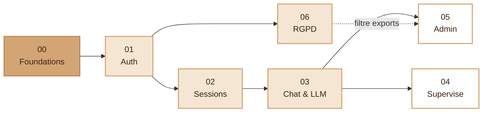

# Specifications — I-AMU

> **Avant de lire ces specs**, lire [`../design/app_architecture.md`](../design/app_architecture.md).
> L'architecture réelle est un **MVC + Domain** : couches `Core/`,
> `Controllers/`, `Services/`, `Models/` (repositories), `Domain/`, `Data/`,
> `Views/`. Le code ne contient **pas** de couche `Application/` ni
> `Infrastructure/`, ni de container DI : on instancie directement (`new`).
>
> ⚠️ **Deux familles de specs, deux niveaux de fraîcheur :**
> - Les specs **numérotées 00–06** sont le **cahier des charges initial**,
>   rédigé pour une tentative d'**architecture hexagonale finalement
>   abandonnée**. Leurs blocs « Domaine / Application / Infrastructure »
>   (namespaces `App\…`, `PdoXxxRepository`, `LlmProviderInterface`, DTOs,
>   ports) décrivent une **intention de design**, pas le code. Chaque spec
>   porte désormais une section « État d'implémentation » qui fait foi, et
>   le détail à jour vit dans les `SPEC-*.md` ci-dessous.
> - Les **`SPEC-*.md`** sont les specs d'implémentation par tranche
>   verticale (plus récentes, alignées MVC). Ce sont elles qui décrivent
>   l'état réel du code.

---

## Index

### Cahier des charges initial (00–06)

| # | Spec | Statut | Périmètre |
|---|---|---|---|
| 00 | [Foundations](./00-foundations.md)              | must-have | Couche `Core/` (Router, Controller, Csrf, HttpException), bootstrap, autoloader Composer |
| 01 | [Auth & Account](./01-auth-account.md)          | must-have | User, login, register, vérif email, compte, préférences |
| 02 | [Sessions](./02-sessions.md)                    | must-have | Session (CRUD + lifecycle DRAFT→ENDED) |
| 03 | [Chat & LLM](./03-chat-llm.md)                  | must-have | Conversation, Interaction, `LlmAdaptaterInterface` (réponse JSON, pas de streaming) |
| 04 | [Supervise](./04-supervise.md)                  | nice-to-have | Suivi live (monitor), (dé)activation d'étudiant |
| 05 | [Admin & Research](./05-admin-research.md)      | nice-to-have | Admin **2 niveaux** (super admin isolé + admin département), modèles, export par session |
| 06 | [RGPD](./06-rgpd.md)                            | must-have | Mention CNIL, 4 droits, journalisation, opposition recherche |

### Specs d'implémentation par tranche (à jour, MVC)

| Spec | Statut | Périmètre |
|---|---|---|
| [SPEC-sessions-backend](./SPEC-sessions-backend.md)   | livré (journal historique) | Slice Sessions enseignant (CRUD + cycle de vie + code d'accès) |
| [SPEC-session-chat-join](./SPEC-session-chat-join.md) | livré (journal historique) | Étudiant rejoint une session → enrôlement + conversation liée |
| [SPEC-session-monitor](./SPEC-session-monitor.md)     | livré | Suivi des étudiants d'une session (lecture seule) |
| [SPEC-session-supervisors](./SPEC-session-supervisors.md) | livré | Profs responsables (co-supervision lecture seule via `teacher_resources`) |
| [SPEC-session-export](./SPEC-session-export.md)       | livré (dette RGPD) | Export JSON des données d'une session (recherche) |
| [SPEC-documents-rag](./SPEC-documents-rag.md)         | phases 1–2 livrées, phase 3 (RAG) à faire | Documents de session + import chat, injection contexte |
| [SPEC-superadmin-auth](./SPEC-superadmin-auth.md)     | livré | Connexion super admin isolée + coquille du panel |
| [SPEC-unify-header](./SPEC-unify-header.md)           | livré | Header unifié (un seul layout authentifié) |

> 📋 Voir aussi [`../design/gap-analysis.md`](../design/gap-analysis.md)
> pour les points encore à clarifier avec le client et les features
> could-have à anticiper.

---

## Roadmap d'implémentation

L'ordre des specs **est** l'ordre recommandé d'implémentation. Chaque
étape ouvre la suivante.



> La spec **06 (RGPD)** est must-have et bloque la mise en production,
> mais elle peut être implémentée **en parallèle** des specs 02–05.
> Le filtre d'opposition à la recherche (flèche pointillée) doit être
> appliqué dans la spec 05 dès qu'elle est en place.

**Stratégie "vertical slice"** : pour chaque spec, on monte un cas
d'usage de bout en bout (Entity → Repository → Service → Controller →
View → tests). On évite les "couches horizontales" finies à 50% qui ne
mènent à rien d'utilisable.

---

## Réutilisation du POC

Le code de la branche `poc` constitue notre **bibliothèque de
référence**. Chaque spec liste explicitement les fichiers à consulter :

```bash
git show poc:app/<chemin>            # afficher un fichier du POC
git checkout poc -- app/<chemin>     # récupérer un fichier dans dev (à refactorer)
```

**Règle** : on ne copie jamais le POC tel quel dans `dev/`. On consulte,
on extrait la logique métier, on la remet **propre** dans la nouvelle
structure.

---

## Template d'une spec

Toute nouvelle spec dans ce dossier doit suivre cette structure :

```markdown
# Spec NN — <Nom>

## 0. Statut
- Priorité : must-have / nice-to-have / experimental
- Dépend de : spec NN-A, spec NN-B
- État POC : implémenté / partiel / absent

## 1. Objectifs
Une phrase claire de ce que la feature fait, pour qui.

## 2. User stories
- En tant que <rôle>, je veux <action> pour <bénéfice>.

## 3. Domaine (`Domain/`)

### Entities / enums
- `Xxx` (champs, invariants, méthodes de comportement)
- `XxxStatus` / `XxxType` (enums string-backed, `label()`, etc.)

> Une seule interface est admise dans le Domain : `LlmAdaptaterInterface`.
> Pas d'interface de repository ni de « port » — on reste concret.

## 4. Services (`Services/`) — logique applicative

- `XxxService` (reçoit un `PDO` au constructeur) : méthodes par cas
  d'usage, comportement attendu, exceptions levées. Renvoie souvent un
  tableau `['success' => bool, 'error'? => string]` ou une entité.
- Validation HTTP : classe `XxxForm` (ex. `CreateSessionForm::fromPost`).

## 5. Models (`Models/`) — accès données

- `XxxRepository` (reçoit un `PDO`) : requêtes préparées, renvoie des
  tableaux associatifs ou des entités du Domain. Pas d'interface.

### Adapters externes
- (si applicable, ex: `OllamaAdaptater`, `MailService`)

## 6. HTTP

### Routes (déclarées dans `app/public/index.php`)
- `GET  /xxx        → XxxController::method`
- `POST /xxx/yyy    → XxxController::method`

### Controllers (`Controllers/`)
- `XxxController::method(...)` — lit `input()`/`query()`, appelle un
  Service/Repository, rend une vue ou redirige. `verifyCsrf()` sur les POST.

### Views
- `app/src/Views/pages/xxx/yyy.php`

## 7. Base de données

### Tables impactées
- `xxx` : colonnes ajoutées/modifiées
- Le schéma vit dans [`database/schema/`](../../database/schema/)
  (`01_schema.sql`, `02_triggers.sql`) — **il n'y a pas de dossier
  `database/migrations/`**. Une évolution de schéma se reflète directement
  dans `01_schema.sql` (source de vérité), appliquée au rebuild du conteneur
  `db`.

## 8. Réutilisation POC

- `git show poc:app/...` — quoi extraire
- ⚠️ À ne PAS copier : (anti-patterns à laisser derrière)

## 9. Tests

| Niveau | Cible | Exemples |
|---|---|---|
| Unit Domain | Entity invariants | … |
| Unit Application | Service avec mocks | … |
| Integration | Repository PDO | … |
| Acceptance | Route HTTP | … |

## 10. Anti-patterns spécifiques
- ❌ ce qu'on ne fait PAS dans cette feature
```

---

## Conventions transverses

> Source de vérité du nommage : [`../conventions/php.md`](../conventions/php.md).
> Rappel des conventions **réelles** (MVC, pas hexagonal) :

- **Entity / enum du Domain** : nom au singulier (`Session`, `Conversation`,
  `Document`), enums string-backed (`SessionStatus`, `SessionType`,
  `DocumentStatus`).
- **Repository (Models)** : entité + `Repository`, **sans** préfixe techno
  (`SessionRepository`, `UserRepository` — pas `PdoSessionRepository`).
- **Service** : domaine fonctionnel + `Service` (`AuthService`,
  `SessionService`, `ChatService`) — un service par scope, pas un par cas
  d'usage.
- **Controller** : entité + `Controller` (`SessionController`).
- **Interface** : suffixe `Interface`. **Une seule est conservée** :
  `LlmAdaptaterInterface` (impl. `OllamaAdaptater`). Les interfaces de
  repository / ports décrites dans les specs 00–06 n'existent pas.

### Erreurs
- Exceptions du Domain : `<Cas>Exception` (ex: `SessionNotFoundException`,
  `SessionAlreadyStartedException`).
- Les controllers attrapent, traduisent en `flash error` ou en réponse JSON.

### Validation
- **Format / structure** : Value Object (`Email::__construct` lance).
- **Règles métier** : Entity ou Service (`Session::start()` refuse si `Cancelled`).
- **Validation HTTP** : `Forms/XxxForm` ou `XxxRequest` (champs requis,
  longueur, etc.).

### Commits
- Format conventional : `feat(sessions): …`, `fix(auth): …`, `chore(...)`, etc.
- **Messages en anglais**, à l'impératif présent.
  - ✅ `feat(sessions): add post-prompt override field`
  - ❌ `feat(sessions): ajoute le champ post-prompt`
- Un commit = un slice cohérent. On peut faire plusieurs commits par spec.
- **Pas de co-auteur Claude** par défaut.

---

## Questions fréquentes

**Q. Faut-il finir 00-foundations.md avant de toucher aux autres ?**
Oui. C'est le seul prerequis dur. Les autres peuvent être faits en
parallèle après foundations, mais l'ordre listé minimise les blocages.

**Q. Une feature manque, où la mettre ?**
- Si elle s'inscrit dans le périmètre d'une spec existante, l'ajouter.
- Sinon, créer une nouvelle spec numérotée à la suite (06, 07…).

**Q. Une spec doit-elle être figée ?**
Non. Toute spec évolue avec la connaissance qu'on acquiert en
l'implémentant. Mettre à jour le doc en même temps que le code.
