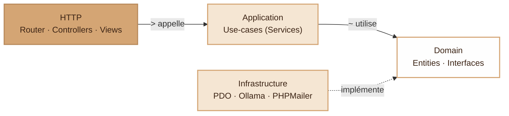
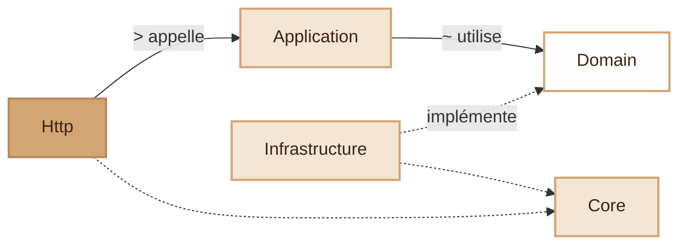

# Architecture applicative I-AMU

> **But du document** — définir l'architecture cible pour la réécriture de
> l'application sur la branche `dev`, en s'appuyant sur les enseignements du
> POC (`branche poc`) et en formalisant les patterns Clean Architecture que
> l'on souhaite introduire.

---

## 1. Objectifs et contraintes

### Objectifs
- **MVC clair** : un contrôleur reste petit, lit ses entrées, délègue à un
  service, rend une vue.
- **Code testable** : un test unitaire ne doit pas nécessiter de DB ni
  d'accès réseau pour vérifier de la logique métier.
- **Substitution facile** des dépendances externes : on doit pouvoir
  remplacer Ollama par OpenAI, PHPMailer par un faux mailer en test, PDO
  par un repository en mémoire, **sans changer le code métier**.
- **Pas de framework lourd** : on reste sur du PHP 8.1+ natif, avec un
  routeur maison et un autoloader maison (`app/autoload.php`).
- **Migration progressive** : la nouvelle architecture doit pouvoir être
  introduite par petits morceaux sans tout réécrire d'un coup.

### Non-objectifs (anti-périmètre)
- ❌ Pas d'Event Bus, pas de CQRS strict, pas d'Hexagonal complet.
- ❌ Pas de DI Container automatique (Symfony, PHP-DI, …) — on injecte à la
  main dans un fichier `bootstrap.php`.
- ❌ Pas d'ORM (Doctrine, Eloquent) — on garde PDO directement dans les
  repositories.
- ❌ Pas de couche GraphQL/REST séparée — la sortie HTTP, c'est du HTML +
  endpoints JSON ponctuels pour AJAX.

---

## 2. Vue d'ensemble



Les flèches pleines représentent des **appels** (Http → Application →
Domain). La flèche pointillée représente une **implémentation** :
Infrastructure fournit le code derrière les interfaces déclarées par le
Domain, sans que Domain ne sache que PDO ou Ollama existent.

**Règle d'or** — les flèches ne vont QUE vers le bas et vers la gauche.
Le Domain ne sait pas que PDO existe. Une Entity ne `require` aucun fichier
de `Infrastructure/`.

---

## 3. Couches et responsabilités

### 3.1 `Core/` — micro-framework

Le « moteur » HTTP minimal. **Ne contient aucune logique métier.**

| Classe              | Rôle                                                            |
|---------------------|-----------------------------------------------------------------|
| `Application`       | Bootstrap : charge la config, démarre la session, dispatche.    |
| `Router`            | Table de routes → contrôleur + méthode + paramètres.            |
| `Request`           | Wrapper immuable de `$_GET`, `$_POST`, `$_SERVER`, headers.     |
| `Response`          | Optionnel : objet de retour. Sinon le contrôleur fait `echo`.   |
| `Controller` (abstrait) | `render($view, $data)`, `json($payload)`, `redirect($url)`. |
| `Csrf`              | Génération + vérification de jeton CSRF.                        |
| `Validator`         | Validation déclarative simple (`required`, `email`, etc.).      |

> Ce que **ne fait pas** Core : pas de SQL, pas d'envoi d'email, pas
> d'appel à Ollama. Si on remplaçait toute la couche métier, Core devrait
> rester intact.

### 3.2 `Domain/` — modèle métier

Le cœur du projet. **Pas un seul `use` qui sorte de `App\Domain\*` ou de
classes natives PHP (`DateTimeImmutable`, `\DomainException`, …).**

#### Entities — `App\Domain\Entities`

Objets PHP avec leurs invariants. **Pas de getters/setters magiques** ;
on expose ce qui a du sens. On évite de les rendre mutables sans raison.

```php
final class Session
{
    public function __construct(
        private readonly int $id,
        private string $name,
        private SessionStatus $status,         // ValueObject (enum)
        private AccessCode $accessCode,
        private ?DateTimeImmutable $startsAt,
        private ?DateTimeImmutable $endsAt,
    ) {}

    public function start(DateTimeImmutable $now): void
    {
        if ($this->status === SessionStatus::Cancelled) {
            throw new DomainException('Une session annulée ne peut être démarrée.');
        }
        $this->status = SessionStatus::Active;
        $this->startsAt ??= $now;
    }

    public function id(): int { return $this->id; }
    public function status(): SessionStatus { return $this->status; }
    // …
}
```

#### Value Objects — `App\Domain\ValueObjects`

Petites classes ou enums qui représentent un concept métier avec ses
règles. Immuables et auto-validants.

```php
enum SessionStatus: string {
    case Draft     = 'DRAFT';
    case Scheduled = 'SCHEDULED';
    case Active    = 'ACTIVE';
    case Ended     = 'ENDED';
    case Cancelled = 'CANCELLED';
}

final class AccessCode {
    public function __construct(public readonly string $value) {
        if (!preg_match('/^[A-Z0-9]{6}$/', $value)) {
            throw new InvalidArgumentException("Code d'accès invalide : $value");
        }
    }
    public function __toString(): string { return $this->value; }
}
```

#### Repository interfaces — `App\Domain\Repositories`

Le Domain **déclare** ce dont il a besoin pour persister/lire, mais ne
sait pas **comment** c'est implémenté.

```php
interface SessionRepositoryInterface
{
    public function findById(int $id): ?Session;
    public function findByAccessCode(AccessCode $code): ?Session;
    public function save(Session $session): void;
    /** @return list<Session> */
    public function findAllForTeacher(int $teacherId): array;
}
```

Tout objet implémentant cette interface est utilisable. La couche
Application n'a aucun moyen de savoir si c'est du PDO, du JSON, ou un
fake en mémoire.

#### Domain exceptions

Une exception par règle métier violée — pas de message générique.

```php
final class SessionAlreadyStartedException extends DomainException {}
final class StudentNotInSessionException   extends DomainException {}
```

### 3.3 `Application/` — use-cases

Orchestre des entités et des repositories pour réaliser **un cas d'usage**.
Un service applicatif = **un verbe métier**. Pas de découpage par entité.

```
StartSessionService
PauseSessionService
EndSessionService
SendStudentPromptService
FlagPromptService
ExportResearchCorpusService
SyncOllamaModelsService
```

Convention : `XxxService` avec une méthode publique principale (souvent
`execute(...)` ou un verbe). Évite la classe « God » avec 12 méthodes.

```php
final class StartSessionService
{
    public function __construct(
        private SessionRepositoryInterface $sessions,
        private ClockInterface $clock,                 // interface pour mockable
    ) {}

    public function execute(int $sessionId): Session
    {
        $session = $this->sessions->findById($sessionId)
            ?? throw new SessionNotFoundException();

        $session->start($this->clock->now());          // règle métier dans l'entité
        $this->sessions->save($session);

        return $session;
    }
}
```

#### DTOs — `App\Application\DTOs`

Pour les use-cases qui ont plus d'un paramètre primitif, on définit un
DTO. Évite les `execute($a, $b, $c, $d)` illisibles, et regroupe la
validation.

```php
final class CreateSessionRequest
{
    public function __construct(
        public readonly string  $name,
        public readonly SessionType $type,
        public readonly ?DateTimeImmutable $startsAt,
        public readonly int $durationMinutes,
        /** @var list<int> */
        public readonly array $modelIds,
        public readonly ?string $systemPrompt,
    ) {}
}
```

### 3.4 `Infrastructure/` — adapters concrets

C'est ici qu'on parle à PDO, à PHPMailer, à `file_get_contents`, à
l'horloge système. Chaque adapter **implémente une interface du Domain
ou de l'Application**.

```
Infrastructure/
├── Persistence/
│   ├── PdoConnection.php             # singleton autorisé ici uniquement
│   ├── PdoUserRepository.php         # implements UserRepositoryInterface
│   ├── PdoSessionRepository.php
│   └── …
├── Mail/
│   ├── PhpMailerSender.php           # implements MailerInterface
│   └── LogMailerSender.php           # alternative pour tests / dev
├── Llm/
│   ├── OllamaLlmProvider.php         # implements LlmProviderInterface
│   └── FakeLlmProvider.php           # pour tests
├── Clock/
│   └── SystemClock.php               # implements ClockInterface
└── Csrf/
    └── SessionCsrfStore.php
```

> Un `PdoUserRepository` peut **hydrater** une `Domain\Entities\User` depuis
> un row PDO, mais **ne peut pas** être typé en retour avec un `array`
> opaque. Sinon on perd tout le bénéfice.

### 3.5 `Http/` — couche présentation

Les contrôleurs lisent les paramètres HTTP, appellent un service,
rendent une vue. **Ils ne contiennent ni SQL ni logique métier.**

```php
final class SessionController extends Controller
{
    public function __construct(
        private StartSessionService $startSession,
        private SessionRepositoryInterface $sessions,
    ) {}

    public function start(Request $request, int $id): Response
    {
        $this->requireRole('teacher');
        $this->csrf->verify($request);

        try {
            $session = $this->startSession->execute($id);
        } catch (SessionNotFoundException) {
            return $this->redirect('/sessions')->withFlash('error', 'Session introuvable.');
        }

        return $this->redirect("/sessions/{$session->id()}")
            ->withFlash('success', 'Session démarrée.');
    }
}
```

Pour rendre une vue, on lui passe **un view-model** (DTO de lecture)
plutôt qu'un mélange d'entités et de bouts d'arrays. Cela évite que les
vues fassent des appels à des méthodes d'entité.

---

## 4. Règles de dépendance

### Vue par flux d'appels



### Matrice complète

| De ↓ vers →    | `Core` | `Domain` | `Application` | `Infrastructure` | `Http` |
|----------------|:------:|:--------:|:-------------:|:----------------:|:------:|
| `Core`         |   —    | non      | non           | non              | non   |
| `Domain`       | non    |   —      | non           | non              | non   |
| `Application`  | non    | oui      |   —           | non              | non   |
| `Infrastructure` | oui  | oui      | non           |   —              | non   |
| `Http`         | oui    | oui (lect.)| oui         | non (via interface) |   —    |

**À retenir** :
- Les flèches vont du **plus externe** (Http) vers le **plus interne**
  (Domain).
- Domain n'a aucune dépendance vers l'extérieur (ni `Core`).
- Http n'instancie **jamais** directement un adapter d'Infrastructure ;
  il reçoit une interface via son constructeur (cf. bootstrap §7).

---

## 5. Structure de dossiers cible

```
.
├── app_architecture.md          ← ce fichier
├── composer.json                ← garde, juste pour gérer PHPMailer en vendor/
├── public/
│   ├── index.php                ← front controller
│   └── assets/
├── app/
│   ├── autoload.php             ← spl_autoload_register manuel (PSR-4 + fallback)
│   ├── bootstrap.php            ← câblage manuel des dépendances (DI maison)
│   │
│   ├── config/
│   │   ├── config.php
│   │   └── routes.php
│   │
│   ├── Core/                    ← framework HTTP minimal
│   ├── Domain/
│   │   ├── Entities/
│   │   ├── ValueObjects/
│   │   ├── Repositories/        ← INTERFACES seulement
│   │   └── Exceptions/
│   │
│   ├── Application/
│   │   ├── Services/            ← use-cases (XxxService)
│   │   ├── DTOs/                ← XxxRequest / XxxView
│   │   └── Ports/               ← interfaces de services externes
│   │
│   ├── Infrastructure/
│   │   ├── Persistence/         ← Pdo*Repository, PdoConnection
│   │   ├── Mail/                ← PhpMailerSender
│   │   ├── Llm/                 ← OllamaLlmProvider
│   │   ├── Clock/               ← SystemClock
│   │   └── Csrf/
│   │
│   ├── Http/
│   │   ├── Controllers/
│   │   ├── Forms/               ← validation des inputs HTTP
│   │   └── ViewModels/          ← objets de présentation
│   │
│   ├── Helpers/                 ← fonctions globales (icon(), …)
│   └── Views/                   ← templates PHP (layout, pages)
│
├── database/
│   ├── schema.sql
│   ├── seed.sql
│   └── migrations/
│
├── tests/                       ← PHPUnit, organisé en miroir de app/
│   ├── Unit/Domain/
│   ├── Unit/Application/
│   ├── Integration/Infrastructure/
│   └── Acceptance/Http/
│
└── vendor/                      ← géré par composer install (PHPMailer)
```

---

## 6. Conventions

### Namespaces et fichiers
- Tout sous `App\<Couche>\<...>`.
  - `App\Domain\Entities\Session`
  - `App\Application\Services\StartSessionService`
  - `App\Infrastructure\Persistence\PdoSessionRepository`
  - `App\Http\Controllers\SessionController`
- **PascalCase** pour les dossiers de classes (`Domain/Entities/`,
  `Application/Services/`). L'autoloader maison gère aussi la casse
  basse pour la transition (cf. `app/autoload.php`).
- Un fichier = une classe, même nom.

### Suffixes recommandés

| Suffixe                | Couche           | Sens                                       |
|------------------------|------------------|--------------------------------------------|
| `*Interface`           | Domain / App     | Contrat (ex: `MailerInterface`)            |
| `*Repository`          | Infrastructure   | Implémentation d'un repo                   |
| `*Service`             | Application      | Use-case orchestré                         |
| `*Controller`          | Http             | Endpoint HTTP                              |
| `*Request`             | Application/Http | DTO d'entrée (validation)                  |
| `*View` / `*ViewModel` | Application/Http | DTO de sortie pour les vues                |
| `*Exception`           | Domain / App     | Violation d'invariant ou cas d'usage échoué |

### Méthodes
- **Verbes** dans la couche Application : `execute()`, `start()`, `pause()`.
- **Noms** dans le Domain : `id()`, `name()`, `isActive()`.
- Pas de getters auto (`getName`) ; on préfère `name()` plus court.

### Visibilité
- `private readonly` pour les dépendances injectées.
- `final class` partout — on dérive volontairement par composition, pas
  par héritage. Exception : les classes abstraites de `Core/`.

---

## 7. Patterns clés (avec exemples)

### 7.1 Interface ≠ réutilisation de méthode

> **Clarification importante.** Une interface PHP **ne contient pas de
> code** — c'est un *contrat*. Elle sert à la **substitution** (DIP), pas
> à la réutilisation directe d'implémentation.

Si on veut **réutiliser du code** :

| Besoin                                  | Outil PHP                       |
|-----------------------------------------|---------------------------------|
| Contrat / substitution (DIP)            | `interface`                     |
| Code commun + contrat                   | `abstract class`                |
| Code horizontal pur (mixin)             | `trait`                         |
| Composition (« has-a » plutôt que « is-a ») | service injecté par constructeur |

Exemple : tous les repositories ont besoin d'un PDO. On crée une
**classe abstraite** `PdoRepository` (réutilisation) + chaque repo
implémente une **interface** du Domain (contrat).

```php
abstract class PdoRepository {
    public function __construct(protected PdoConnection $db) {}
    protected function fetchOne(string $sql, array $params): ?array { … }
    protected function fetchAll(string $sql, array $params): array { … }
}

final class PdoSessionRepository
    extends PdoRepository
    implements SessionRepositoryInterface
{
    public function findById(int $id): ?Session { … }
    public function save(Session $session): void { … }
}
```

### 7.2 Repository

**Une interface par agrégat racine** (User, Session, Conversation).
Pas un repo générique. Le but est de modéliser des **requêtes métier**,
pas de l'opération CRUD anonyme.

```php
interface ConversationRepositoryInterface {
    public function findById(int $id): ?Conversation;
    /** @return list<Conversation> */
    public function findOpenForSession(int $sessionId): array;
    public function save(Conversation $conv): void;
    public function archive(int $id): void;
}
```

> Anti-pattern à éviter : `$repo->findBy(['status' => 'OPEN'])` — ça
> remet de la connaissance SQL dans le caller. Préférer
> `findOpenForSession(int)` qui exprime l'intention.

### 7.3 Service externe via interface (Port & Adapter)

```php
// Domain (ou Application) — le port
interface LlmProviderInterface {
    /** @param list<array{role:string, content:string}> $messages */
    public function chat(string $modelTag, array $messages, ?string $system): LlmResponse;
    /** @return list<LlmModelInfo> */
    public function listModels(): array;
}

// Infrastructure — l'adapter
final class OllamaLlmProvider implements LlmProviderInterface {
    public function __construct(
        private string $baseUrl,
        private ClockInterface $clock,
    ) {}
    public function chat(…): LlmResponse { /* cURL Ollama */ }
    public function listModels(): array { /* GET /api/tags */ }
}

// Infrastructure — adapter alternatif pour tests
final class FakeLlmProvider implements LlmProviderInterface {
    public function chat(…): LlmResponse {
        return new LlmResponse('réponse fake', inputTokens: 1, outputTokens: 2, latencyMs: 5);
    }
}
```

Le contrôleur ne voit jamais `OllamaLlmProvider`, seulement
`LlmProviderInterface`. Swapper Ollama → OpenAI = écrire
`OpenAiLlmProvider implements LlmProviderInterface` et changer une ligne
dans `bootstrap.php`.

### 7.4 Entity vs ViewModel

| Étape                  | Type d'objet                | Pourquoi                              |
|------------------------|-----------------------------|---------------------------------------|
| Lecture en DB          | `Session` (Entity)          | On a besoin de ses comportements      |
| Passage à la vue       | `SessionListView` (ViewModel) | Aplati, primitives uniquement, pas de logique |

```php
final class SessionListView {
    public function __construct(
        public readonly int $id,
        public readonly string $name,
        public readonly string $statusLabel,    // déjà traduit FR
        public readonly string $accessCode,
        public readonly ?string $startsAtFormatted,
        public readonly bool $canEdit,
        public readonly bool $canStart,
    ) {}

    public static function fromEntity(Session $s, Clock $now): self { … }
}
```

La vue PHP devient triviale : `<?= $session->statusLabel ?>` au lieu
d'avoir à appeler `$sessionModel->computedStatus($session)` depuis la vue.

---

## 8. Workflow d'une requête HTTP

Exemple : un enseignant clique sur "Démarrer" pour la session #12.

```mermaid
sequenceDiagram
    autonumber
    actor B as &gt; Browser
    participant F as index.php + Application
    participant C as SessionController
    participant S as StartSessionService
    participant R as PdoSessionRepository
    participant DB as PostgreSQL

    B->>F: POST /sessions/12/start
    F->>C: dispatch (Router)
    Note over C: csrf check<br/>role check
    C->>S: execute(12)
    S->>R: findById(12)
    R->>DB: SELECT * FROM session
    DB-->>R: row
    R-->>S: Session (entity)
    Note over S: Session.start(clock.now())<br/>règle métier dans l'entité
    S->>R: save(session)
    R->>DB: UPDATE session
    S-->>C: Session (mise à jour)
    C-->>B: 302 redirect /sessions/12
```

Lecture rapide :
- **étapes 1-2** : routage HTTP (Core).
- **étape 3** : contrôleur (Http) — vérifications transverses, délègue.
- **étapes 4-9** : use-case (Application) qui parle au repo via une
  *interface*, jamais à PDO directement.
- **étapes 5, 7, 10** : Infrastructure — seule couche autorisée à parler
  à la DB.
- **étape 8** : règle métier dans l'entité du Domain.

Tout au long, **personne** ne fait `Database::getInstance()` ou
`new OllamaLlmProvider()`. Le câblage est fait une seule fois dans
`bootstrap.php`.

---

## 9. Bootstrap et DI manuel

Vu qu'on n'utilise pas de container automatique, on assemble les
dépendances explicitement dans `app/bootstrap.php` :

```php
<?php
$config = require __DIR__ . '/config/config.php';

// --- Infrastructure : briques basses ---
$db          = new PdoConnection($config['database']);
$clock       = new SystemClock();
$mailer      = new PhpMailerSender($config['mail']);
$llmProvider = new OllamaLlmProvider($config['ollama']['host'], $clock);

// --- Repositories (implémentent les interfaces Domain) ---
$userRepo    = new PdoUserRepository($db);
$sessionRepo = new PdoSessionRepository($db);
$convRepo    = new PdoConversationRepository($db);
$llmModelRepo= new PdoLlmModelRepository($db);

// --- Application services (use-cases) ---
$startSession = new StartSessionService($sessionRepo, $clock);
$sendPrompt   = new SendStudentPromptService($convRepo, $llmProvider, $clock);
$syncModels   = new SyncOllamaModelsService($llmModelRepo, $llmProvider);

// --- Controllers (instanciés une fois, partagés) ---
$controllers = [
    SessionController::class => new SessionController($startSession, $sessionRepo, …),
    ChatController::class    => new ChatController($sendPrompt, $convRepo, …),
    …
];

return [
    'application' => new Application($controllers, $config),
];
```

Si le câblage devient trop verbeux, on extraira en mini-factory par
couche, mais on n'introduit pas de container magique tant que ça reste
gérable.

---

## 10. Tests

| Type                  | Cible                                              | Outils                                  |
|-----------------------|----------------------------------------------------|-----------------------------------------|
| **Unit Domain**       | Entities, ValueObjects                             | PHPUnit. Pas de DB, pas de mock.        |
| **Unit Application**  | Services. Mocks d'interfaces Domain.               | PHPUnit. Fakes en mémoire bienvenus.    |
| **Integration**       | `Pdo*Repository` contre vraie DB de test           | PHPUnit + DB postgres temporaire.       |
| **Acceptance** (E2E)  | Routes HTTP via cURL ou client interne             | PHPUnit + Apache de dev.                |

Règle : **un bug = un test**. Si un test ne peut pas être écrit
facilement, c'est probablement un signe d'architecture (couplage à DB
ou réseau).

---

## 11. Comparaison POC → cible

| Aspect                | POC actuel                                        | Cible                                            |
|-----------------------|---------------------------------------------------|--------------------------------------------------|
| Modèles               | `extends Model` → ActiveRecord, mélange métier + DB | Entity + Repository séparés                      |
| Database              | `Database::getInstance()` partout                  | `PdoConnection` injecté, jamais en singleton statique |
| Services              | Sans interface (`new OllamaService()` direct)      | Interface dans Domain/Application + adapter dans Infrastructure |
| Ollama                | `OllamaService` couplé                             | `LlmProviderInterface` + `OllamaLlmProvider`     |
| Validation des inputs | `trim($this->input('x', ''))` éparpillé           | `XxxRequest` + `Validator` centralisé            |
| Tests                 | Inexistants                                        | PHPUnit, miroir de `app/`                        |
| Vues                  | Reçoivent des arrays PDO bruts                     | Reçoivent des ViewModels typés                   |
| DI                    | Implicite (singleton + new direct)                 | Explicite dans `bootstrap.php`                   |

---

## 12. Migration progressive (ordre suggéré)

On ne réécrit pas tout d'un coup. Voici l'ordre d'introduction :

1. **Squelette** : créer les dossiers `Domain/`, `Application/`,
   `Infrastructure/`, `Http/`. Bootstrap minimal.
2. **Premier vertical slice** : refaire `start session` de bout en bout
   (Entity Session, Repository interface + impl PDO, Service, Controller).
   Ça sert d'archétype.
3. **Couche LLM** : extraire `LlmProviderInterface` et bouger
   `OllamaService` en `OllamaLlmProvider`. Permet d'écrire un
   `FakeLlmProvider` pour tester le flux chat.
4. **Repositories** un par un : User, Session, Conversation, Interaction,
   LlmModel. Chaque migration retire un `extends Model` et un appel
   `Database::getInstance()` du métier.
5. **Mailer** : `MailerInterface` + `PhpMailerSender` + `LogMailerSender`
   (utile en dev).
6. **ViewModels** : un par page complexe (dashboard, supervise, research).
   Les autres pages peuvent rester en mode "view reçoit array" pour
   l'instant.
7. **Tests** : commencer par les Entities et les Services applicatifs.

---

## 13. Anti-patterns à éviter

- ❌ `Database::getInstance()` en dehors de `Infrastructure/Persistence/`.
- ❌ `new OllamaLlmProvider()` dans un contrôleur (passe par l'interface).
- ❌ Une entité qui sait écrire dans la DB (`$user->save()`). C'est le
  job du repository.
- ❌ Une vue qui appelle des méthodes complexes
  (`<?= $sessionModel->computedStatus($session) ?>`). Précalculer dans un
  ViewModel.
- ❌ Une interface qui ne sert qu'une seule implémentation **et** qui ne
  sera jamais mockée. Inutile, on garde la classe concrète.
- ❌ Mettre tous les use-cases dans un seul `SessionService` avec 15
  méthodes. Préférer un service par use-case (= un verbe).
- ❌ Un service applicatif qui retourne un row PDO brut. Toujours
  retourner une entité, un ViewModel, ou un primitif.

---

## 14. FAQ

**Q. Faut-il créer une interface pour CHAQUE classe ?**
Non. Règle pragmatique : interface si on veut **substituer** (test ou
swap de provider). Pour une classe Domain pure (ex: `AccessCode`), pas
besoin d'interface.

**Q. Où mettre la validation des emails / mots de passe / codes ?**
Dans le ValueObject correspondant (`Email::__construct` lance si
invalide). Le service applicatif ne valide plus le format, seulement la
logique métier ("cet email est-il déjà pris ?").

**Q. Comment gérer les transactions DB qui touchent plusieurs repos ?**
Le service applicatif appelle `$db->beginTransaction()` / `commit()` /
`rollback()` via une `TransactionManagerInterface` (ou injection directe
de `PdoConnection`, c'est un cas où on peut tolérer). Garder ça léger,
ne pas inventer un Unit of Work.

**Q. Que fait-on des helpers globaux (`icon()`) ?**
Ils restent dans `app/Helpers/` et sont chargés dans `bootstrap.php`.
Acceptable car purement fonctionnel et sans état. À utiliser uniquement
dans les vues.

**Q. Et `composer.json` ?**
Conservé pour gérer la dépendance `phpmailer/phpmailer` dans `vendor/`.
On n'utilise plus son autoloader (cf. `app/autoload.php`). Les sections
`autoload` / `autoload-dev` ont été retirées.

---

*Document vivant — toute évolution de l'architecture doit être discutée
en équipe et reflétée ici.*
