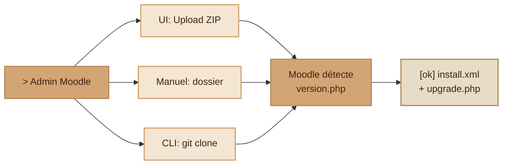
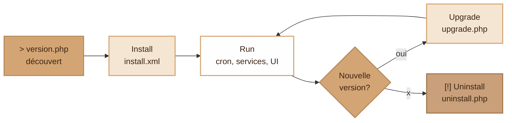

# Plugins Moodle — Création, installation et utilisation

> Documentation de référence sur le fonctionnement des plugins Moodle : types, structure, cycle de vie et exposition d'API.

---

## 1. Vue d'ensemble

Moodle est un LMS **entièrement modulaire** : tout (ou presque) est un plugin. Le core fournit une API, des hooks et des conventions ; chaque plugin se branche dessus en respectant une structure de dossier stricte.

Le **type** du plugin détermine :

- où il se trouve dans l'arborescence Moodle,
- comment il s'intègre dans l'UI,
- les hooks/APIs qu'il peut implémenter,
- son préfixe de composant (`local_xxx`, `mod_xxx`, `block_xxx`…).

---

## 2. Types de plugins

| Type     | Dossier                      | Rôle                                                                  |
| -------- | ---------------------------- | --------------------------------------------------------------------- |
| `mod`    | `mod/`                       | Activité de cours (Quiz, Devoir, Forum, H5P…)                         |
| `block`  | `blocks/`                    | Bloc latéral (Calendrier, Dernières news, Progression…)               |
| `local`  | `local/`                     | Fonctionnalité transversale : intégrations, services web, tâches cron |
| `auth`   | `auth/`                      | Méthode d'authentification (LDAP, DB externe, OAuth2…)                |
| `enrol`  | `enrol/`                     | Méthode d'inscription aux cours                                       |
| `theme`  | `theme/`                     | Apparence du site                                                     |
| `format` | `course/format/`             | Format de présentation d'un cours (topics, weekly, tiles…)            |
| `qtype`  | `question/type/`             | Type de question de quiz                                              |
| `report` | `report/` ou `admin/report/` | Rapports admin                                                        |
| `tool`   | `admin/tool/`                | Outils d'administration                                               |
| `filter` | `filter/`                    | Filtres de contenu (mathjax, multilang…)                              |

### Quel type choisir ?

- **Intégrer une web app externe comme activité d'un cours** → préférer **LTI 1.3** (natif, pas de plugin) ou un `mod` custom.
- **Exposer un service web / lancer un cron / brancher une API externe** → `local`.
- **Authentification déléguée** → `auth`.
- **Inscriptions automatiques depuis un SI** → `enrol`.
- **UI réutilisable sur tableau de bord ou page de cours** → `block`.

> Astuce : si un plugin doit toucher à plusieurs domaines (ex. ajouter un bloc + un service web + des tâches), on met la logique commune dans un `local` et on garde un `block` minimaliste qui appelle le `local`.

---

## 3. Structure d'un plugin

Exemple pour un plugin local nommé `local_monplugin` :

```
moodle/local/monplugin/
├── version.php                       # Métadonnées et version (OBLIGATOIRE)
├── lib.php                           # Callbacks vers le core (hooks legacy)
├── settings.php                      # Page de réglages admin
├── index.php                         # Point d'entrée éventuel
├── db/
│   ├── install.xml                   # Schéma BD initial (format XMLDB)
│   ├── upgrade.php                   # Migrations entre versions
│   ├── access.php                    # Capabilities (permissions)
│   ├── services.php                  # Services web exposés
│   ├── events.php                    # Event observers
│   └── tasks.php                     # Tâches planifiées (cron)
├── classes/                          # Code PSR-4, namespace = nom du plugin
│   ├── external/                     # Définitions d'API webservices
│   ├── task/                         # Tâches planifiées
│   └── event/                        # Événements custom
├── lang/
│   ├── en/local_monplugin.php        # Chaînes EN (obligatoire)
│   └── fr/local_monplugin.php        # Traductions
├── templates/                        # Templates Mustache
├── amd/src/                          # Modules JS (build avec grunt)
└── pix/                              # Images
```

### Fichiers clés

#### `version.php`

Lu en **premier** par Moodle pour découvrir le plugin et déclencher install/upgrade.

```php
<?php
defined('MOODLE_INTERNAL') || die();

$plugin->component = 'local_monplugin';   // <type>_<nom> — unique
$plugin->version   = 2026052700;          // AAAAMMJJXX — incrémenter à chaque release
$plugin->requires  = 2024040100;          // Version min de Moodle
$plugin->maturity  = MATURITY_STABLE;     // ALPHA | BETA | RC | STABLE
$plugin->release   = 'v1.0';
$plugin->dependencies = [                 // Optionnel
    'mod_forum' => 2024040100,
];
```

#### `lang/en/local_monplugin.php`

Toutes les chaînes affichées doivent passer par `get_string()` pour la traduction.

```php
<?php
$string['pluginname']        = 'Mon Plugin';
$string['monplugin:view']    = 'Voir Mon Plugin';
$string['settingsheading']   = 'Réglages de Mon Plugin';
$string['api_endpoint']      = 'URL de l\'API externe';
$string['api_endpoint_desc'] = 'Endpoint HTTPS de la web app à appeler.';
```

Usage côté code :

```php
echo get_string('pluginname', 'local_monplugin');
```

#### `db/install.xml`

Schéma BD initial au format **XMLDB** (propre à Moodle, généré via un éditeur intégré : _Site administration → Development → XMLDB editor_).

```xml
<?xml version="1.0" encoding="UTF-8" ?>
<XMLDB PATH="local/monplugin/db" VERSION="2026052700">
  <TABLES>
    <TABLE NAME="local_monplugin_items" COMMENT="Items synchronisés">
      <FIELDS>
        <FIELD NAME="id"        TYPE="int"  LENGTH="10"  NOTNULL="true" SEQUENCE="true"/>
        <FIELD NAME="userid"    TYPE="int"  LENGTH="10"  NOTNULL="true"/>
        <FIELD NAME="payload"   TYPE="text"              NOTNULL="false"/>
        <FIELD NAME="timecreated" TYPE="int" LENGTH="10" NOTNULL="true"/>
      </FIELDS>
      <KEYS>
        <KEY NAME="primary" TYPE="primary" FIELDS="id"/>
        <KEY NAME="fk_user" TYPE="foreign" FIELDS="userid" REFTABLE="user" REFFIELDS="id"/>
      </KEYS>
    </TABLE>
  </TABLES>
</XMLDB>
```

> ⚠️ Ne jamais écrire de SQL `CREATE TABLE` à la main : Moodle traduit le XMLDB en SQL adapté au SGBD configuré (MySQL/MariaDB/PostgreSQL/MSSQL/Oracle).

#### `db/upgrade.php`

Migrations exécutées quand `$plugin->version` augmente.

```php
<?php
function xmldb_local_monplugin_upgrade($oldversion) {
    global $DB;
    $dbman = $DB->get_manager();

    if ($oldversion < 2026053000) {
        $table = new xmldb_table('local_monplugin_items');
        $field = new xmldb_field('status', XMLDB_TYPE_CHAR, '20', null, XMLDB_NOTNULL, null, 'pending');
        if (!$dbman->field_exists($table, $field)) {
            $dbman->add_field($table, $field);
        }
        upgrade_plugin_savepoint(true, 2026053000, 'local', 'monplugin');
    }
    return true;
}
```

#### `db/access.php`

Définit les **capabilities** (permissions). Moodle gère ensuite les rôles via l'UI admin.

```php
<?php
$capabilities = [
    'local/monplugin:view' => [
        'captype'       => 'read',
        'contextlevel'  => CONTEXT_SYSTEM,
        'archetypes'    => [
            'user'           => CAP_ALLOW,
            'editingteacher' => CAP_ALLOW,
        ],
    ],
    'local/monplugin:manage' => [
        'captype'       => 'write',
        'contextlevel'  => CONTEXT_SYSTEM,
        'archetypes'    => [
            'manager' => CAP_ALLOW,
        ],
    ],
];
```

Vérification dans le code :

```php
require_capability('local/monplugin:manage', context_system::instance());
```

#### `db/services.php` — exposer une API webservices

```php
<?php
$functions = [
    'local_monplugin_get_items' => [
        'classname'   => 'local_monplugin\external\get_items',
        'methodname'  => 'execute',
        'description' => 'Retourne la liste des items pour un utilisateur',
        'type'        => 'read',
        'ajax'        => true,
        'capabilities' => 'local/monplugin:view',
    ],
];
```

Implémentation : `classes/external/get_items.php`

```php
<?php
namespace local_monplugin\external;

use external_api;
use external_function_parameters;
use external_value;
use external_multiple_structure;
use external_single_structure;

class get_items extends external_api {
    public static function execute_parameters() {
        return new external_function_parameters([
            'userid' => new external_value(PARAM_INT, 'User ID'),
        ]);
    }
    public static function execute($userid) {
        global $DB;
        self::validate_parameters(self::execute_parameters(), ['userid' => $userid]);
        require_capability('local/monplugin:view', \context_system::instance());
        return $DB->get_records('local_monplugin_items', ['userid' => $userid]);
    }
    public static function execute_returns() {
        return new external_multiple_structure(
            new external_single_structure([
                'id'      => new external_value(PARAM_INT,  'ID'),
                'userid'  => new external_value(PARAM_INT,  'User ID'),
                'payload' => new external_value(PARAM_RAW,  'Données', VALUE_OPTIONAL),
            ])
        );
    }
}
```

Appel depuis une web app externe :

```
GET https://moodle.exemple.org/webservice/rest/server.php
    ?wstoken=XXXX
    &wsfunction=local_monplugin_get_items
    &moodlewsrestformat=json
    &userid=42
```

#### `db/tasks.php` — tâche cron

```php
<?php
$tasks = [
    [
        'classname' => 'local_monplugin\task\sync_task',
        'blocking'  => 0,
        'minute'    => '*/15',
        'hour'      => '*',
        'day'       => '*',
        'month'     => '*',
        'dayofweek' => '*',
    ],
];
```

`classes/task/sync_task.php` :

```php
<?php
namespace local_monplugin\task;

class sync_task extends \core\task\scheduled_task {
    public function get_name() {
        return get_string('synctask', 'local_monplugin');
    }
    public function execute() {
        // Logique de synchro
        mtrace('Sync en cours...');
    }
}
```

#### `settings.php` — page admin

```php
<?php
defined('MOODLE_INTERNAL') || die();

if ($hassiteconfig) {
    $settings = new admin_settingpage('local_monplugin', get_string('pluginname', 'local_monplugin'));
    $ADMIN->add('localplugins', $settings);

    $settings->add(new admin_setting_configtext(
        'local_monplugin/api_endpoint',
        get_string('api_endpoint', 'local_monplugin'),
        get_string('api_endpoint_desc', 'local_monplugin'),
        'https://api.example.com',
        PARAM_URL
    ));
}
```

> ⚠️ `settings.php` ne doit **jamais** exécuter de requêtes BD au chargement (il est inclus à chaque page admin).

---

## 4. Installation d'un plugin

Trois voies, toutes équivalentes une fois les fichiers en place :

### 4.1 Via l'interface admin (recommandé pour les utilisateurs finaux)

1. _Administration du site → Plugins → Installer des plugins_
2. Soit upload d'un **ZIP** local, soit recherche dans le **répertoire officiel** (`https://moodle.org/plugins`).
3. Moodle décompresse au bon endroit, détecte la nouvelle version et lance le wizard d'installation.

### 4.2 Manuel (filesystem)

1. Décompresser le plugin dans son dossier (`local/monplugin/`, `mod/monplugin/`, …).
2. Se connecter en admin → Moodle compare `version.php` aux versions installées et propose **Continue**.
3. Le wizard exécute `db/install.xml` (création des tables) puis `db/upgrade.php` si nécessaire.

### 4.3 CLI (recommandé pour la prod / CI)

```bash
git clone https://github.com/org/moodle-local_monplugin.git local/monplugin
php admin/cli/upgrade.php --non-interactive
```

### Désinstallation

_Administration du site → Plugins → Vue d'ensemble des plugins → Uninstall_ → Moodle supprime les tables (selon `db/uninstall.php` si défini) et le code.

### Flow des 3 voies d'installation



---

## 5. Cycle de vie d'un plugin



| Étape     | Ce qui se passe                                                    |
| --------- | ------------------------------------------------------------------ |
| Discovery | Moodle scanne les dossiers et lit chaque `version.php`             |
| Install   | Exécution de `install.xml` (tables), capabilities, services, tasks |
| Upgrade   | Bump de version → `upgrade.php` joue les migrations                |
| Uninstall | Suppression des tables (via `uninstall.php` si défini)             |

**Spécificité des plugins `local`** : ils sont toujours installés/mis à jour **en dernier**, ce qui leur permet d'étendre ou de modifier ce que les autres plugins ont créé.

---

## 6. Utilisation côté utilisateur

| Type    | Comment l'utilisateur l'utilise                                                                                         |
| ------- | ----------------------------------------------------------------------------------------------------------------------- |
| `mod`   | Apparaît dans le sélecteur d'activités du cours                                                                         |
| `block` | Apparaît dans la liste « Ajouter un bloc » sur dashboard / page de cours                                                |
| `local` | Pas d'UI imposée — peut ajouter des entrées au menu admin, des pages personnalisées, ou être invisible (cron, services) |
| `auth`  | Devient un choix dans les méthodes d'authentification                                                                   |
| `enrol` | Devient une méthode d'inscription sélectionnable dans un cours                                                          |

---

## 7. Bonnes pratiques

1. **Suffixer toutes les tables** par le nom du plugin : `local_monplugin_items`, pas `items`.
2. **Préfixer toutes les chaînes de langue** par leur fichier (`local_monplugin`).
3. **Toujours passer par l'API `$DB`** de Moodle (`$DB->get_record`, `$DB->insert_record`…) plutôt que d'écrire du SQL brut.
4. **Utiliser `get_string()` partout** : zéro chaîne hardcodée dans l'UI.
5. **Garder `lib.php` minimal** : déplacer la logique dans `classes/` (autoload PSR-4).
6. **Versionner les migrations** avec `upgrade_plugin_savepoint()` après chaque étape.
7. **Capabilities granulaires** : une par action (`:view`, `:edit`, `:manage`).
8. **Tester sur la matrice supportée** : la version min déclarée dans `$plugin->requires` doit être respectée.
9. **Publier sur `moodle.org/plugins`** pour profiter de la mise à jour automatique côté admin.

---

## 8. Ressources

- [Moodle Developer Resources — Local plugins](https://moodledev.io/docs/4.5/apis/plugintypes/local)
- [Moodle Developer Resources — Block plugins](https://moodledev.io/docs/4.4/apis/plugintypes/blocks)
- [MoodleDocs — Installing plugins](https://docs.moodle.org/501/en/Installing_plugins)
- [Moodle Developer Resources (portail général)](https://moodledev.io/)
- [Répertoire officiel des plugins](https://moodle.org/plugins/)
- [XMLDB editor (documentation)](https://docs.moodle.org/dev/XMLDB_editor)
- [Web services API](https://docs.moodle.org/dev/Web_services_API)
