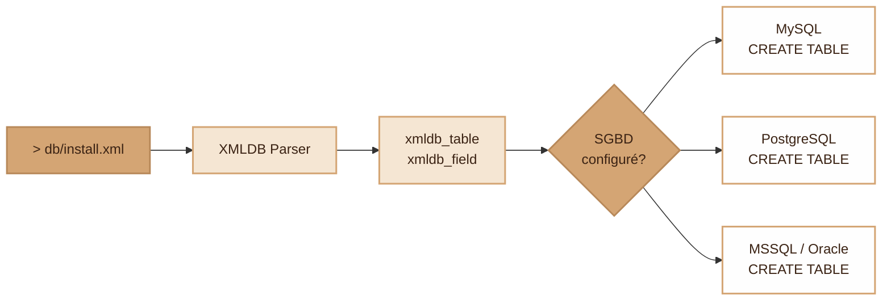
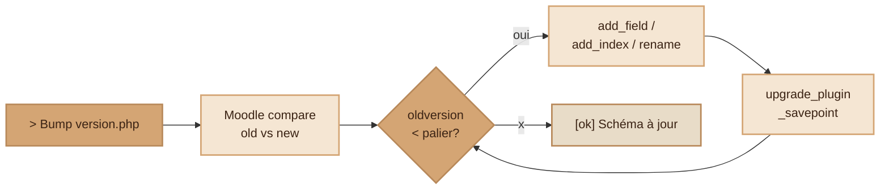
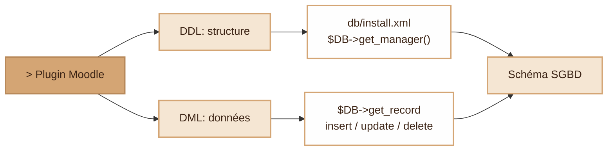

# XMLDB — La couche d'abstraction BD de Moodle

> Documentation de référence sur le système XMLDB de Moodle : description du schéma de base de données en XML, traduction vers SQL natif, et APIs DDL/DML associées.

---

## 1. Pourquoi du XML et pas du SQL ?

Moodle supporte officiellement **5 SGBD** : MySQL/MariaDB, PostgreSQL, MSSQL, Oracle, SQLite. Chacun a sa propre syntaxe pour `CREATE TABLE`, ses propres types (`SERIAL` vs `AUTO_INCREMENT` vs `IDENTITY`), ses propres limites de longueur de noms, etc.

Plutôt que de demander aux développeurs de plugins de maintenir 5 fichiers SQL, Moodle a créé **XMLDB** : une description **neutre** en XML que Moodle traduit à la volée en SQL natif pour le SGBD configuré.



C'est la même philosophie qu'un ORM, mais sans ORM : Moodle reste sur du SQL « brut » via une API (`$DB`), juste sans coupler le schéma à un dialecte.

---

## 2. Structure d'un `install.xml`

Hiérarchie :

```
XMLDB
└── TABLES
    └── TABLE
        ├── FIELDS
        │   └── FIELD (× N)
        ├── KEYS
        │   └── KEY (× N)
        └── INDEXES
            └── INDEX (× N)
```

### Exemple complet

```xml
<?xml version="1.0" encoding="UTF-8" ?>
<XMLDB PATH="local/monplugin/db"
       VERSION="2026052700"
       COMMENT="Schéma de local_monplugin">

  <TABLES>
    <TABLE NAME="local_monplugin_items" COMMENT="Items synchronisés">
      <FIELDS>
        <FIELD NAME="id"          TYPE="int"  LENGTH="10" NOTNULL="true" SEQUENCE="true"/>
        <FIELD NAME="userid"      TYPE="int"  LENGTH="10" NOTNULL="true"/>
        <FIELD NAME="courseid"    TYPE="int"  LENGTH="10" NOTNULL="true"/>
        <FIELD NAME="title"       TYPE="char" LENGTH="255" NOTNULL="true"/>
        <FIELD NAME="description" TYPE="text" NOTNULL="false"/>
        <FIELD NAME="score"       TYPE="number" LENGTH="10" DECIMALS="2" NOTNULL="false"/>
        <FIELD NAME="status"      TYPE="char" LENGTH="20" NOTNULL="true" DEFAULT="pending"/>
        <FIELD NAME="timecreated" TYPE="int"  LENGTH="10" NOTNULL="true"/>
        <FIELD NAME="timemodified" TYPE="int" LENGTH="10" NOTNULL="true"/>
      </FIELDS>

      <KEYS>
        <KEY NAME="primary"    TYPE="primary" FIELDS="id"/>
        <KEY NAME="userid"     TYPE="foreign" FIELDS="userid"
             REFTABLE="user"   REFFIELDS="id"/>
        <KEY NAME="courseid"   TYPE="foreign" FIELDS="courseid"
             REFTABLE="course" REFFIELDS="id"/>
      </KEYS>

      <INDEXES>
        <INDEX NAME="status-timecreated" UNIQUE="false" FIELDS="status, timecreated"/>
      </INDEXES>
    </TABLE>
  </TABLES>
</XMLDB>
```

---

## 3. Attributs des `FIELD`

| Attribut    | Valeurs                                | Rôle |
|-------------|----------------------------------------|------|
| `NAME`      | a-z, 0-9, _ — max **63 chars**         | Nom de la colonne |
| `TYPE`      | `int`, `char`, `text`, `binary`, `number`, `float`, `datetime` | Type neutre |
| `LENGTH`    | nombre                                 | Taille (chars pour `char`, chiffres pour `int`/`number`) |
| `DECIMALS`  | nombre                                 | Décimales (pour `number`/`float`) |
| `NOTNULL`   | `true` / `false`                       | Contrainte NOT NULL |
| `UNSIGNED`  | `true` / `false`                       | (déprécié depuis 2.3) |
| `SEQUENCE`  | `true` / `false`                       | Auto-incrément (en pratique : PK) |
| `DEFAULT`   | valeur                                 | Valeur par défaut |
| `COMMENT`   | texte                                  | Documentation |
| `PREVIOUS`  | nom de champ                           | Ordre des colonnes (géré par l'éditeur) |

### Types de champs

| Type XMLDB | MySQL          | PostgreSQL    | Usage |
|------------|----------------|---------------|-------|
| `int`      | `BIGINT`       | `BIGINT`      | Entiers — **les timestamps Unix sont des `int`** dans Moodle |
| `char`     | `VARCHAR(n)`   | `VARCHAR(n)`  | Chaînes courtes (≤ 1333 chars) |
| `text`     | `LONGTEXT`     | `TEXT`        | Texte long sans limite pratique |
| `binary`   | `LONGBLOB`     | `BYTEA`       | Données binaires |
| `number`   | `DECIMAL(l,d)` | `NUMERIC(l,d)`| Décimaux exacts (argent, scores) |
| `float`    | `DOUBLE`       | `DOUBLE`      | Flottants (déconseillé, préférer `number`) |
| `datetime` | déprécié       | déprécié      | À ne plus utiliser → stocker un timestamp `int` |

> 🗓️ **Convention Moodle** : tous les timestamps (création, modification, deadline…) sont stockés en `int` (Unix epoch). Pas de type date natif.

---

## 4. Clés (`KEY`) et index (`INDEX`)

### Types de clés

| `TYPE`            | Effet |
|-------------------|-------|
| `primary`         | Clé primaire — toujours nommée `primary` |
| `foreign`         | Clé étrangère — crée automatiquement l'index associé |
| `unique`          | Contrainte d'unicité (+ index) |
| `foreign-unique`  | FK + UNIQUE en une seule déclaration |

### Conventions de nommage

- **Clé primaire** : toujours `NAME="primary"` (exception).
- **Autres clés / index** : concaténer les noms de champs avec `-`. Ex. pour les champs `userid` et `courseid` → `NAME="userid-courseid"`.
- **Foreign key** : indiquer `REFTABLE` et `REFFIELDS`. Moodle ne crée **pas** réellement la contrainte FK au niveau SGBD (pour des raisons historiques de portabilité), mais s'en sert pour générer l'index et documenter le schéma.

### Index

```xml
<INDEX NAME="status-timecreated"
       UNIQUE="false"
       FIELDS="status, timecreated"/>
```

---

## 5. L'éditeur XMLDB intégré

Moodle ships avec un **éditeur graphique** pour ne pas écrire le XML à la main :

**Site administration → Development → XMLDB editor**

Workflow :
1. Créer un dossier `db/` (writable) dans ton plugin.
2. Cliquer **Create** → `install.xml` vide.
3. **Load** → **Edit** → ajout de tables, fields, keys, indexes via formulaires.
4. **Save** → écrit le XML proprement formaté.
5. **View PHP Code** → génère automatiquement le code à coller dans `db/upgrade.php` (cf. section 7).

C'est l'outil officiel, recommandé : il valide la cohérence (longueur des noms, types, ordres des champs) et calcule les hashes du schéma.

---

## 6. Comment Moodle utilise `install.xml` à l'installation

Quand on installe un plugin :

```
1. Moodle lit version.php → "tiens, nouvelle version"
2. Lit db/install.xml
3. Parse le XML → objets internes (xmldb_table, xmldb_field…)
4. Le driver SGBD (mysql, pgsql…) traduit en SQL natif
5. Exécute CREATE TABLE
6. (optionnel) Exécute db/install.php pour insérer des données initiales
```

Côté code, c'est l'objet `$DB->get_manager()` (DDL) qui orchestre ça, mais tu n'as pas à l'appeler manuellement à l'install — Moodle le fait pour toi.

---

## 7. Modifier le schéma après coup : `db/upgrade.php`

Une fois un plugin déployé, **on ne touche plus à `install.xml` pour ajouter une colonne**. Il faut :

1. Mettre à jour `install.xml` (pour les nouvelles installations).
2. Bumper `$plugin->version` dans `version.php`.
3. Ajouter un bloc dans `db/upgrade.php` qui applique la migration sur les installations existantes.

```php
<?php
function xmldb_local_monplugin_upgrade($oldversion) {
    global $DB;
    $dbman = $DB->get_manager();

    // Ajout d'une colonne
    if ($oldversion < 2026053000) {
        $table = new xmldb_table('local_monplugin_items');
        $field = new xmldb_field('priority', XMLDB_TYPE_INTEGER, '3',
                                  null, XMLDB_NOTNULL, null, '0', 'status');
        if (!$dbman->field_exists($table, $field)) {
            $dbman->add_field($table, $field);
        }
        upgrade_plugin_savepoint(true, 2026053000, 'local', 'monplugin');
    }

    // Renommage
    if ($oldversion < 2026053100) {
        $table = new xmldb_table('local_monplugin_items');
        $field = new xmldb_field('title');
        $dbman->rename_field($table, $field, 'name');
        upgrade_plugin_savepoint(true, 2026053100, 'local', 'monplugin');
    }

    // Ajout d'un index
    if ($oldversion < 2026053200) {
        $table = new xmldb_table('local_monplugin_items');
        $index = new xmldb_index('userid-courseid', XMLDB_INDEX_NOTUNIQUE,
                                  ['userid', 'courseid']);
        if (!$dbman->index_exists($table, $index)) {
            $dbman->add_index($table, $index);
        }
        upgrade_plugin_savepoint(true, 2026053200, 'local', 'monplugin');
    }

    return true;
}
```

**API DDL principale (`$DB->get_manager()`)** :

| Méthode                 | Action |
|-------------------------|--------|
| `create_table()`        | Crée une table |
| `drop_table()`          | Supprime une table |
| `add_field()`           | Ajoute une colonne |
| `drop_field()`          | Supprime une colonne |
| `change_field_type()`   | Change le type |
| `change_field_default()`| Change la valeur par défaut |
| `change_field_notnull()`| Change la contrainte NOT NULL |
| `rename_field()`        | Renomme une colonne |
| `add_key()` / `drop_key()`     | Gère les clés |
| `add_index()` / `drop_index()` | Gère les index |
| `field_exists()` / `index_exists()` | Tests d'existence (idempotence) |

> 🔒 **Toujours envelopper** chaque étape dans un `if (!$dbman->xxx_exists(...))` et terminer par `upgrade_plugin_savepoint()`. Si la migration plante au milieu, le savepoint permet de reprendre sans rejouer les étapes déjà passées.

### Flow d'une migration



Chaque palier de version a son propre bloc `if`. Si un savepoint est atteint, Moodle l'enregistre : un crash après ce point ne rejouera pas les étapes précédentes.

---

## 8. Manipuler les données : l'API DML (`$DB`)

Le schéma XMLDB ne sert que pour la DDL (structure). Pour lire/écrire les données, on utilise l'API `$DB` partout, jamais de SQL brut concaténé (injection !).

```php
global $DB;

// SELECT
$item  = $DB->get_record('local_monplugin_items', ['id' => 42], '*', MUST_EXIST);
$items = $DB->get_records('local_monplugin_items', ['status' => 'pending']);
$items = $DB->get_records_select('local_monplugin_items',
                                   'timecreated > ?', [time() - 86400]);

// INSERT (renvoie l'id)
$id = $DB->insert_record('local_monplugin_items', (object)[
    'userid'      => $USER->id,
    'courseid'    => $courseid,
    'name'        => 'Demo',
    'status'      => 'pending',
    'timecreated' => time(),
    'timemodified'=> time(),
]);

// UPDATE
$DB->update_record('local_monplugin_items', (object)[
    'id'           => $id,
    'status'       => 'done',
    'timemodified' => time(),
]);

// DELETE
$DB->delete_records('local_monplugin_items', ['id' => $id]);

// SQL custom (avec placeholders nommés)
$DB->get_records_sql(
    'SELECT i.* FROM {local_monplugin_items} i
     JOIN {user} u ON u.id = i.userid
     WHERE u.email = :email',
    ['email' => $email]
);
```

> Les `{nom_table}` dans le SQL sont remplacés automatiquement par le préfixe configuré (souvent `mdl_`). Ne jamais écrire `mdl_user` en dur.

---

## 9. Récap visuel — DDL vs DML



| Couche | Usage                                | Quand                              |
|--------|--------------------------------------|------------------------------------|
| DDL    | Crée/modifie la **structure**        | À l'install et aux migrations      |
| DML    | Lit/écrit les **données**            | À chaque requête utilisateur       |

> Tu ne mélanges jamais les deux : DDL = `install.xml` + `upgrade.php`, DML = code métier du plugin.

---

## 10. Bonnes pratiques XMLDB

1. **Toujours préfixer les tables** par le nom du plugin (`local_monplugin_*`).
2. **Noms en minuscules** uniquement, caractères `a-z 0-9 _`.
3. **Pas de SQL brut** côté DDL : passer par l'éditeur XMLDB ou les méthodes de `$DB->get_manager()`.
4. **Timestamps en `int`**, pas en `datetime`.
5. **Décimaux** : utiliser `number` (DECIMAL), pas `float`, pour tout ce qui doit être exact (notes, montants).
6. **Foreign keys déclarées** même si Moodle ne crée pas la contrainte au SGBD : ça documente et génère l'index.
7. **Tester chaque étape de `upgrade.php`** sur une copie de prod avant de pusher.
8. **Idempotence** : toujours `field_exists()` / `index_exists()` avant `add_*`.
9. **Savepoints** après chaque bloc d'upgrade pour reprendre proprement en cas d'échec.
10. **Ne jamais éditer le préfixe** des tables (`mdl_`) en dur : utiliser `{table}` dans les requêtes SQL.

---

## 11. Ressources

- [MoodleDocs — XMLDB defining an XML structure](https://docs.moodle.org/dev/XMLDB_defining_an_XML_structure)
- [MoodleDocs — Using XMLDB](https://docs.moodle.org/dev/Using_XMLDB)
- [MoodleDocs — XMLDB editing](https://docs.moodle.org/dev/XMLDB_editing)
- [Moodle Developer Resources — XMLDB editor](https://moodledev.io/general/development/tools/xmldb)
- [MoodleDocs — XMLDB Documentation (overview)](https://docs.moodle.org/dev/XMLDB_Documentation)
- [MoodleDocs — XMLDB creating new DDL functions](https://docs.moodle.org/dev/XMLDB_creating_new_DDL_functions)
- [PHPRefresher — XMLDB Editor](https://arcelopera.github.io/PHPRefresher/Moodle/phpMoodleXMLDB/)
