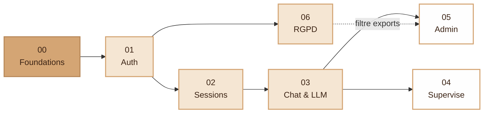

# Specifications — I-AMU

> **Avant de lire ces specs**, lire [`../documentation/app_architecture.md`](../documentation/app_architecture.md).
> Les specs partent du principe que les couches `Core/`, `Domain/`,
> `Application/`, `Infrastructure/`, `Http/` sont déjà comprises.

---

## Index

| # | Spec | Statut | Périmètre |
|---|---|---|---|
| 00 | [Foundations](./00-foundations.md)              | must-have | Couche `Core/`, autoloader, bootstrap, CSRF, Validator |
| 01 | [Auth & Account](./01-auth-account.md)          | must-have | User, login, register, password reset, compte, préférences |
| 02 | [Sessions](./02-sessions.md)                    | must-have | Session (CRUD + lifecycle DRAFT→ENDED) |
| 03 | [Chat & LLM](./03-chat-llm.md)                  | must-have | Conversation, Interaction, LlmProvider, streaming SSE |
| 04 | [Supervise](./04-supervise.md)                  | nice-to-have | Supervision live, signalement, archive |
| 05 | [Admin & Research](./05-admin-research.md)      | nice-to-have | Admin (users/models/config), dashboard chercheur |
| 06 | [RGPD](./06-rgpd.md)                            | must-have | Mention CNIL, 4 droits, journalisation, opposition recherche |

> 📋 Voir aussi [`../documentation/gap-analysis.md`](../documentation/gap-analysis.md)
> pour les points encore à clarifier avec le client et les features
> could-have à anticiper.

---

## Roadmap d'implémentation

L'ordre des specs **est** l'ordre recommandé d'implémentation. Chaque
étape ouvre la suivante.



> La spec **06 (RGPD)** est must-have et bloque la mise en production,
> mais elle peut être implémentée **en parallèle** des specs 02–05.
> Le filtre d'opposition à la recherche (flèche pointillée) doit être
> appliqué dans la spec 05 dès qu'elle est en place.

**Stratégie "vertical slice"** : pour chaque spec, on monte un cas
d'usage de bout en bout (Entity → Repository → Service → Controller →
View → tests). On évite les "couches horizontales" finies à 50% qui ne
mènent à rien d'utilisable.

---

## Réutilisation du POC

Le code de la branche `poc` constitue notre **bibliothèque de
référence**. Chaque spec liste explicitement les fichiers à consulter :

```bash
git show poc:app/<chemin>            # afficher un fichier du POC
git checkout poc -- app/<chemin>     # récupérer un fichier dans dev (à refactorer)
```

**Règle** : on ne copie jamais le POC tel quel dans `dev/`. On consulte,
on extrait la logique métier, on la remet **propre** dans la nouvelle
structure.

---

## Template d'une spec

Toute nouvelle spec dans ce dossier doit suivre cette structure :

```markdown
# Spec NN — <Nom>

## 0. Statut
- Priorité : must-have / nice-to-have / experimental
- Dépend de : spec NN-A, spec NN-B
- État POC : implémenté / partiel / absent

## 1. Objectifs
Une phrase claire de ce que la feature fait, pour qui.

## 2. User stories
- En tant que <rôle>, je veux <action> pour <bénéfice>.

## 3. Domaine

### Entities
- `Xxx` (champs, invariants)

### Value Objects
- `Yyy` (validation, immutabilité)

### Interfaces (repository, ports)
- `XxxRepositoryInterface` (méthodes attendues)

## 4. Application (use-cases)

### Services
- `XxxService::execute(...)` — comportement attendu, exceptions levées.

### DTOs
- `XxxRequest` (champs + règles de validation)
- `XxxView` (champs exposés à la vue)

## 5. Infrastructure

### Repositories
- `PdoXxxRepository implements XxxRepositoryInterface`

### Adapters externes
- (si applicable, ex: LlmProvider, Mailer)

## 6. HTTP

### Routes
- `GET  /xxx        → XxxController::method`
- `POST /xxx/yyy    → XxxController::method`

### Controllers
- `XxxController::method(Request, ...)`

### Views
- `app/Views/pages/xxx/yyy.php`

## 7. Base de données

### Tables impactées
- `xxx` : colonnes ajoutées/modifiées
- Migration : `database/migrations/AAAA-MM-DD-xxx.sql`

## 8. Réutilisation POC

- `git show poc:app/...` — quoi extraire
- ⚠️ À ne PAS copier : (anti-patterns à laisser derrière)

## 9. Tests

| Niveau | Cible | Exemples |
|---|---|---|
| Unit Domain | Entity invariants | … |
| Unit Application | Service avec mocks | … |
| Integration | Repository PDO | … |
| Acceptance | Route HTTP | … |

## 10. Anti-patterns spécifiques
- ❌ ce qu'on ne fait PAS dans cette feature
```

---

## Conventions transverses

### Nommage
- **Entity** : nom simple au singulier (`Session`, `User`, `Conversation`).
- **Value Object** : nom descriptif (`AccessCode`, `Email`, `SessionStatus`).
- **Interface** : suffixe `Interface` (`SessionRepositoryInterface`,
  `LlmProviderInterface`).
- **Service** : verbe + `Service` (`StartSessionService`,
  `SendStudentPromptService`).
- **Controller** : entité + `Controller` (`SessionController`).
- **Repository concret** : préfixe par techno (`PdoSessionRepository`,
  `InMemoryUserRepository`).

### Erreurs
- Exceptions du Domain : `<Cas>Exception` (ex: `SessionNotFoundException`,
  `SessionAlreadyStartedException`).
- Les controllers attrapent, traduisent en `flash error` ou en réponse JSON.

### Validation
- **Format / structure** : Value Object (`Email::__construct` lance).
- **Règles métier** : Entity ou Service (`Session::start()` refuse si `Cancelled`).
- **Validation HTTP** : `Forms/XxxForm` ou `XxxRequest` (champs requis,
  longueur, etc.).

### Commits
- Format conventional : `feat(sessions): …`, `fix(auth): …`, `chore(...)`, etc.
- Un commit = un slice cohérent. On peut faire plusieurs commits par spec.
- **Pas de co-auteur Claude** par défaut.

---

## Questions fréquentes

**Q. Faut-il finir 00-foundations.md avant de toucher aux autres ?**
Oui. C'est le seul prerequis dur. Les autres peuvent être faits en
parallèle après foundations, mais l'ordre listé minimise les blocages.

**Q. Une feature manque, où la mettre ?**
- Si elle s'inscrit dans le périmètre d'une spec existante, l'ajouter.
- Sinon, créer une nouvelle spec numérotée à la suite (06, 07…).

**Q. Une spec doit-elle être figée ?**
Non. Toute spec évolue avec la connaissance qu'on acquiert en
l'implémentant. Mettre à jour le doc en même temps que le code.
